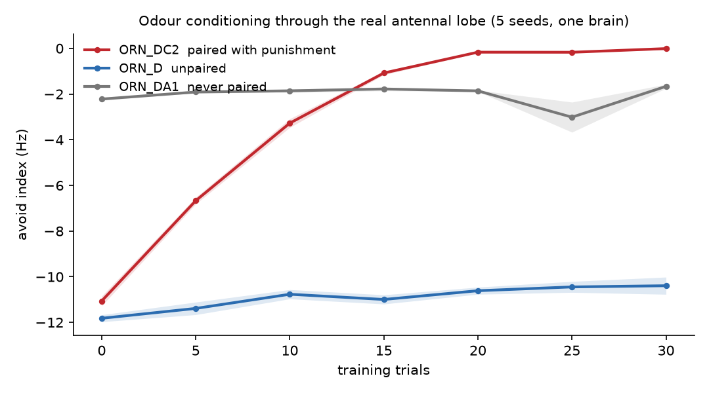

# neuroplasticfly

Dopamine-gated KC->MBON plasticity on the full FlyWire v783 connectome: 139,248 LIF
neurons and 2,700,429 signed synapses held in one flat CUDA tensor. It learns real
odours through its own antennal lobe, and it holds two associations at once.

Daniel Asis, 2026. [ihateflies.ai](https://www.instagram.com/ihateflies.ai)

**v0.1 scope:** this release reproduces the specificity test of the preprint cited below; the relearning test and experiment tooling come in later releases.



One odour (ORN_DC2) is paired with punishment at PPL1 for 30 trials; two others are not.
The avoid index of the paired odour moves +11.05 Hz and the others barely move. The curve
saturates because the whole effect is approach-MBON suppression against a floor -- see
*What this is not*, below.

## Run it

```
git clone https://github.com/AllMites/neuroplasticfly && cd neuroplasticfly
uv sync                      # CUDA 12.8 torch
python reproduce.py
```

Measured end to end on a cold clone, 2026-09-23 (RTX 5070 Ti, Python 3.14.4,
torch 2.11.0+cu128): **7 min** to fetch the 884 MB of inputs, **8 s** to build `data/`,
**15 s** for the CS gate, **11 min** for the conditioning run. Last line:

```
rung A seed 0: DC2 +10.90 Hz (target +11.05 +- 0.6)  PASS  wall clock 11 min
```

That run reproduced the host's numbers exactly -- paired +10.90, unpaired +1.51,
never-paired +0.53, lesion -1.10 Hz -- from nothing but the clone and the two
downloads, and left the working tree clean.

CUDA is required. The simulation is one flat tensor of 2.7 M edges stepped at 0.1 ms;
there is no supported CPU path, and `reproduce.py` stops before the long run if it does
not find a device.

## What it does

| Result | Number | Where it comes from |
|---|---|---|
| Specificity test, paired odour (ORN_DC2) | **+11.05 +- 0.20 Hz** avoid-index shift, 5/5 seeds same sign | `docs/superpowers/option-a/odour_conditioning_2026-09-21.md` |
| Specificity test, unpaired (ORN_D) | +1.43 +- 0.49 Hz | same |
| Specificity test, never paired (ORN_DA1) | +0.56 +- 0.09 Hz | same |
| Specificity test, plasticity lesioned | -0.73 +- 0.41 Hz | same |
| Specificity test, shuffled eligibility | +0.54, i.e. 4.9% of learn | same |
| Accumulation test, second association on an already-trained brain | +9.655 +- 0.451 Hz = **85.5% of naive** (+11.29), both memories co-present | `docs/superpowers/option-a/persistence_interference_2026-09-21.md` |
| Reward path | Christie et al. 2026's sugar-to-PAM result is **not reproduced**: the pathway they describe is present in the connectome at the same synapse counts and conducts for two hops, then **dies at FDA-I -> PAM** (129 synapses, 0.81% of PAM input): 0 of 307 PAM-DANs spiked in 80 runs | `docs/superpowers/reward-path/christie_reconciliation_2026-09-23.md` |

The unconditioned stimulus is therefore injected at PPL1 (punishment) rather than
recruited through sugar. That is a disclosed shortcut, and the reason for it is measured,
not assumed.

## What this is not

These constrain every claim made about this repository.

- **The forgetting curve is a constant we set.** `PL.LAM = 0.01`/trial predicts
  `0.99^30 = 0.7397` weight retention; measured 74.0%, zero variance. Never "its memory
  faded over time" -- that sentence describes a line in `learn/plastic.py`.
- **Retention at the readout (98%) overstates retention at the weights (74%).** Quote the
  weight number.
- **The whole learning effect is approach-MBON suppression** (11.3 -> 0.3 Hz). Avoid MBONs
  never move. The supported claim is "it stops finding the odour attractive", *not* "it
  learns to avoid it". Ceiling-limited: "it learned" holds, "it learned this much" does not.
- **The shuffle control separates at the MBON readout but not at the descending-neuron
  population readout** (r = +0.66..+0.94). The DN signature is not a demonstrated learned code.
- **The 12.9% generalisation to the unpaired odour is a gain artifact** (13.9% at
  PN_KC_GAIN 8, -0.2% at 6), not a property of the odour code.
- **Five seeds are five noise replicates of ONE brain, not five flies.**

## Data

Fetched on first run, never vendored:

- Connections: Zenodo record [10676866](https://zenodo.org/records/10676866)
  (Dorkenwald et al. 2024), `proofread_connections_783.feather`, 852,022,274 bytes,
  md5 `f48f972d262323a102aed49af1396b8a`.
- Annotations: `flyconnectome/flywire_annotations`, Supplemental file 1
  (Schlegel et al. 2024), pinned to release v3.1.0; the commit SHA and sha256 are
  recorded in `data/ext/annotations_provenance.json`.

**Licence of the data is unresolved and is not mine to resolve**: the Zenodo record
states CC-BY-4.0 while flywire.ai states CC BY-NC. Treat the stricter one as binding for
your use; do not build paid products on outputs without checking.

Content hashes of the four built artefacts are in `data/CHECKSUMS.json`, and
`scripts/build_data.py` refuses to finish if a rebuild does not match them. They are
hashes of the arrays, not of the files: an `.npz` is a zip and its entry headers carry
mtimes, so the same brain hashes differently on every rebuild.

## Layout

```
reproduce.py          clone -> rung A, one command
scripts/              fetch_data, build_data (flypoke loader), checksum_data, plot_rung_a
gpu_sim.py            the engine: one CSR tensor, LIF step, run_batch
learn/                conditioning, plasticity rule, CS gate, seed analysis
regime/               ELN_NEGATE / PN_KC_GAIN regimes, nt_conf, silence tests
brain_state/          plastic weight deltas + provenance per published run
docs/superpowers/     the lab notebook: every result above, with its falsifiers
```

The song-conditioning path (`--cs song`) is **not runnable here**: it needs the
`flywatch/` audio tooling and commercial music, neither of which is distributed.
The odour path, which is the published result, needs neither.

`flypoke` is a dependency for its **loader only** (`flypoke.data.build_network`), so that
this repository and the published Shiu-style sims agree about which neuron is index 4711.
Its CPU engine is never called on the odour path.

**Origin.** This began as flychess, an attempt to make the connectome play chess through a
reservoir readout. That is why `encode.py`, `reservoir.py`, `train.py`, `lichess/` and a
`chess` dependency are still here: `gpu_sim` builds its drive and pooling tables through
`encode` and `reservoir` at construction time. `Dockerfile` and `compose.yaml` are the
chess-era container and are not needed -- the reproducible path is host-only.
`export_brain.py` and `readout_analysis.py` are the container scripts that produced the
first build; `scripts/build_data.py` replaces them on the host and is verified to
reproduce their output array for array.

## Cite

Preprint: Asis, D. (2026). Specific, cumulative and reversible odour learning in a whole-brain connectome model of *Drosophila*. bioRxiv. [BIORXIV LINK]

Software: `CITATION.cff`. Code is MIT (`LICENSE`); figures CC-BY; the connectome is not mine to
license (see *Data*).
